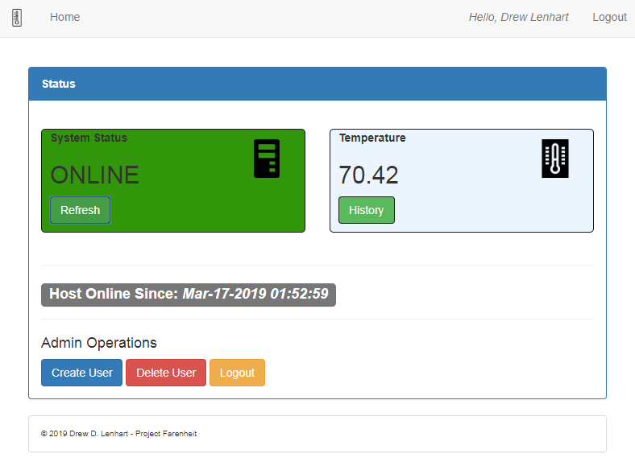

# project-farenheit

### Experiment Status: TESTING | Experiment Start Date: April 8, 2019

### [View current data here](data/temperature_fw_in.dat)

**Update 4-17-19: Putting this experiment on hold - the Raspberry Pi used for this project died after the first night of testing =(**
***
## Introduction

This project is a fun little experiment with a Raspberry Pi 2. Awhile ago, a Youtube video caught my attention about building a computer system to last decades with minimal downtime. The video didn't really go into the "how" or the technical side of actually building a system. It did, however make some interesting points on what you need to think about when planning for such a system. [How to build a System that will run for 30 years](https://youtu.be/ALEor2mnIsI)

I thought it would be interesting, as an experiment, to see if I can build a system that lasts for years, even a decade! I also wanted this system to actually perform a specific function. How long can I manage to keep it alive without little to no maintenance? To do this experiment, I had absolutely no budget (HAHA), so I settled on using equipment I already had around the house.

A few years ago, approx 2015, I bought a Raspberry Pi 2 & a DS18B20 waterproof temperature sensor and other various components needed from Adafruit (see links below). I got it to function, using a script to record the temperature from the sensor and log it to a database. I even built a small web dashboard to display the temperature. It ran in my laundry room for several months, collecting the temperature. After a house move, it was disconnected and sat in a drawer for 2 years, oops. This will be re-used for my experiment.

***
## The Goal

Build a temperature gathering system & application to run on a Raspberry Pi. The application will log the current temperature to a flat file two times a day. The goal is to keep the system running as long as possible with minimal maintenance.

**Requirements:**
* **House the Raspberry Pi & other components in an enclosure**
  1. The DS18B20 cable must be run outside of house.
* **Indicator light system - use GPIO pins.**
  1.  Light system will flash red/green based on results from Restful API endpoint.
* **Restful API**
  1.  Endpoint to log temperature to flat file ( no database! ).
  2.  Endpoint to test thermometer ( for dashboard & indicator lights ).
  3.  Endpoint to check system uptime.
* **Dashboard**
  1.  Display thermometer status & current temperature.
  2.  Interface to read datafile ( history ).
  3.  Authentication.
* **Various scripts**
  1.  Bash script to CURL temperature endpoint ( CRON job ).
  2.  Bash script to commit data file nightly ( CRON job ).
  3.  Python script to turn on/off led's via gpio pins.
    1. Bash script to CURL test endpoint.

***
## Hardware

**Parts:**
* Raspberry Pi w/ Raspbian installed.
* [DS18B20 Digital Temperature sensor](https://www.adafruit.com/product/381)
* 4.7K or 10K ohm resistor
* Breadboard (solderable)
* Jump wires
* [Pi Cobbler](https://www.adafruit.com/product/2029)
* IDE ribbon cable.

**Note these may be added down the road**
* 2nd Raspberry Pi ( backup Pi ).
* [Battery backup](https://www.adafruit.com/product/1565) - more thoughts on this later.

**Temperature sensor setup**

I followed the [Temperature sensor assembly instructions](https://learn.adafruit.com/adafruits-raspberry-pi-lesson-11-ds18b20-temperature-sensing/hardware) from Adafruit. It is pretty easy to get up and going with these instructions. I also used a 1 x 2 inch solderable breadboard for a more stable solution and is just big enough to hold the Pi Cobbler, temp sensor, and indicator lights without getting too cramped.

Below is the schematic (taken from Adafruit and used without permission):

My final circuit (without light indicator wiring):

**Temperature Sensor Setup**

There are a few steps in order to begin collecting temperature, so we need to add OneWire support.

On the Raspberry Pi, add the below line to `/boot/config.txt`

`dtoverlay=w1-gpio` -- then reboot the Pi.

Finally:

>sudo modprobe w1-gpio 
>sudo modprobe w1-therm 
>cd /sys/bus/w1/devices 
>ls 
>cd 28-xxxx (change xxxx to what shows from above command) 
>cat w1_slave

You should see two lines outputted from the above command. The first line ends in either YES or NO. If a YES is displayed, the sensor received a good reading. The 2nd line outputs the temperature, for example `a2 01 4b 46 7f ff 0e 10 d8 t=023345` where `t=023345` is the raw temperature and needs to be converted.

**NOTE: type `pwd` to get the full path of the `w1_slave` file, this path is needed for the software installation below and will need to be entered into `config.ini`!**

**Indicator Light Setup**

More info on this soon!

**Final Assembly**

Since this project is heavily on the cheap side, I decided to enclose everything in a metal case. The case is from an old exterior timer for a lighting system, and works great for this project as the inside is large enough for everything. I drilled two holes on the front cover door for the 2 indicator LED's and painted the case with a rubbed bronze spray paint.

Case with Pi mounted - no cover:

Case put together - no light indicator assembly:

***

## Software

The main software components are the Dashboard and the Restful API.

**Dashboard**

The dashboard is self explanatory. Displays current temperature on page load ( Ajax call to API ). Refresh button sends additional call. History directs to separate page which reads datafile.

Screen shot if temperature sensor is unable to get a reading:

## Software Requirements

Keep in mind you really need to fulfill the existing hardware for this to be useful, although you can replace the `GPIO_TEST` setting in `config.ini` to `true`, and the application will use the provided mock file located at `/data/w1-slave` ( allows you to at least tinker with the application without the temperature sensor )

* PHP 7.1 +
* Apache w/ mod_rewrite (see link below)
* [Composer](https://getcomposer.org/download/)
* Python ( some scripts required )

[See instructions for preparing a Raspberry Pi with PHP 7.2 & required modules](https://www.tal.org/tutorials/raspberrypi_php_apache)

## Software Setup

* Run - **composer install** in project root.
* Apache - point virtual host document root to `public/`
* Ensure `logs/` `data/` is web writable.
* Launch `http://localhost` or `http://servername` & follow install instructions.

**OR**

* Run - **composer install** in project root
* Launch LOCAL PHP Server from folder `php -S localhost:8000 -t public public/index.php`
  1. OPTIONAL: Launch server.bat if on Windows or server.sh for Linux - (alternative)!
  2. Visit `http://localhost:8000` & follow install instructions.

**Additional Steps**

* Update `scripts/record_temperature.sh` with username/password created in installation.
  1. Update URL if needed.
* Update `config.ini`, `GPIO_PATH` with location of temperature output file (See hardware above)
  a. e.g. ``

***
## Final Thoughts

I went on the cheapest route possible for this project and re-used a lot of components I already had lying around. If I were to do a second version of this project, I would definitely make the whole unit smaller using a Raspberry Pi Zero or perhaps something else. I think I would also make the unit weather proof & power it with solar to keep it outside permanently.

***
## Website

* https://drewlenhart.com

## License

MIT License

Copyright (c) 2018 Drew D. Lenhart

Permission is hereby granted, free of charge, to any person obtaining a copy of this software and associated documentation files (the "Software"), to deal in the Software without restriction, including without limitation the rights to use, copy, modify, merge, publish, distribute, sublicense, and/or sell copies of the Software, and to permit persons to whom the Software is furnished to do so, subject to the following conditions:

The above copyright notice and this permission notice shall be included in all copies or substantial portions of the Software.

THE SOFTWARE IS PROVIDED "AS IS", WITHOUT WARRANTY OF ANY KIND, EXPRESS OR IMPLIED, INCLUDING BUT NOT LIMITED TO THE WARRANTIES OF MERCHANTABILITY, FITNESS FOR A PARTICULAR PURPOSE AND NONINFRINGEMENT. IN NO EVENT SHALL THE AUTHORS OR COPYRIGHT HOLDERS BE LIABLE FOR ANY CLAIM, DAMAGES OR OTHER LIABILITY, WHETHER IN AN ACTION OF CONTRACT, TORT OR OTHERWISE, ARISING FROM, OUT OF OR IN CONNECTION WITH THE SOFTWARE OR THE USE OR OTHER DEALINGS IN THE SOFTWARE.
